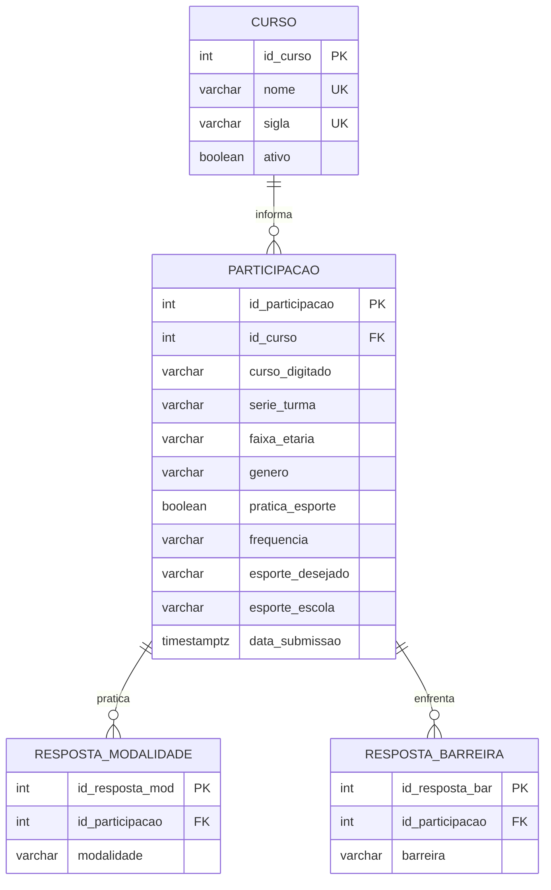

# Especificação de Requisitos e Modelagem de Dados — Mapa Esportivo

**Sistema de Levantamento e Diagnóstico de Perfil Esportivo Escolar**  
**Instituição:** Colégio EREM Santa Ana (Escola de Referência em Ensino Médio Santa Ana — Olinda/PE)  
**Projeto:** Engenharia de Software / Análise de Sistemas / Banco de Dados  
**Ano/Período:** 2026.2  

---

## 1. O que é o Projeto

### 1.1. Definição do Sistema
O **Mapa Esportivo** é uma plataforma web de levantamento censitário e diagnóstico analítico sobre a prática de atividades físicas, interesses esportivos e barreiras enfrentadas pelos estudantes do **Colégio EREM Santa Ana (Escola de Referência em Ensino Médio Santa Ana)**, localizada em Olinda/PE.

### 1.2. Contexto Institucional
O Colégio EREM Santa Ana atende centenas de jovens no Ensino Médio Integral e propedêutico/técnico. O diagnóstico abrange os três anos do Ensino Médio:
- **1º Ano**
- **2º Ano**
- **3º Ano**

No campo de identificação de curso/itinerário, o sistema disponibiliza opções ágeis com os cursos técnicos de referência em saúde da rede estadual (`Nutrição e Dietética`, `Farmácia`, `Enfermagem`), além da opção de digitação livre (`Outro`), permitindo o acolhimento de qualquer itinerário formativo ou turma da escola.

### 1.3. Problema que o Projeto Resolve
Tradicionalmente, a elaboração do plano pedagógico de Educação Física, a oferta de escolinhas esportivas, oficinas extracurriculares e os Jogos Escolares ocorrem sem uma base estatística representativa. Isso acarreta:
1. **Descompasso de modalidades**: oferta concentrada exclusivamente em esportes tradicionais (como futsal), sem aferir demandas reais como dança, artes marciais, vôlei, basquete, musculação ou calistenia;
2. **Falta de diagnóstico de barreiras**: desconhecimento dos fatores que limitam os estudantes (falta de tempo, espaço escolar reduzido, custo de equipamentos ou falta de oportunidade na escola);
3. **Inviabilidade de pesquisas em papel**: perda de questionários impressos, custos de fotocópias e demora excessiva na tabulação manual;
4. **Viés por falta de privacidade**: alunos sedentários ou com dificuldades evitam participar de questionários nominais.

O Mapa Esportivo provê um **questionário discente digital desidentificado (100% anônimo)** e um **painel analítico (dashboard) em tempo real** para orientar gestores e professores com base em evidências estatísticas.

---

## 2. Requisitos Funcionais (RF)

| Código | Nome | Descrição Objetiva |
|---|---|---|
| **RF01** | Coleta de Perfil Demográfico | O sistema deve coletar do estudante: Curso Técnico/Itinerário, Série/Turma, Faixa Etária e Gênero, sem exigir identificadores pessoais (nome, CPF, matrícula). |
| **RF02** | Seleção e Digitação de Curso | O sistema deve disponibilizar como primeiras opções cursos da rede (`Nutrição e Dietética`, `Farmácia`, `Enfermagem`), a opção `Outro` e, caso `Outro` seja selecionado, exibir um campo de texto obrigatório para digitação livre do curso/itinerário (2 a 80 caracteres). |
| **RF03** | Seleção de Série / Turma | O sistema deve restringir a seleção de série/turma exclusivamente às opções do Ensino Médio: `1º Ano`, `2º Ano` e `3º Ano`. |
| **RF04** | Coleta de Prática Esportiva Atual | O sistema deve permitir ao estudante declarar objetivamente se pratica atualmente alguma atividade física ("Sim, pratico" ou "Não pratico"). |
| **RF05** | Seleção de Modalidades Praticadas | O sistema deve permitir ao estudante marcar uma ou múltiplas modalidades que pratica (`Futebol`, `Vôlei`, `Futsal`, `Basquete`, `Corrida/caminhada`, `Ciclismo`, `Musculação/academia`, `Dança`, `Artes marciais`, `Outro`). |
| **RF06** | Coleta de Frequência Semanal | O sistema deve registrar a regularidade semanal de prática (`Todos os dias`, `4–6 vezes por semana`, `2–3 vezes por semana`, `1 vez por semana`, `Menos de 1 vez por semana` ou `Não pratico`). |
| **RF07** | Condicionalidade de Prática | Caso o estudante informe que não pratica atividade física (RF04 = falso), o sistema deve desativar as perguntas de modalidades e fixar a frequência em `Não pratico`. |
| **RF08** | Coleta de Interesse Pessoal | O sistema deve permitir ao estudante selecionar a modalidade que ele mais gostaria de praticar ou aprender. |
| **RF09** | Coleta de Barreiras e Dificuldades | O sistema deve permitir a seleção múltipla de fatores limitantes (`Falta de tempo`, `Falta de espaço`, `Falta de equipamentos`, `Falta de dinheiro`, `Falta de companhia`, `Falta de oportunidade na escola`, `Falta de interesse`, `Outro`) ou a opção exclusiva `Nada dificulta`. |
| **RF10** | Coleta de Demanda Esportiva Escolar | O sistema deve permitir ao estudante indicar qual modalidade ele mais gostaria de ver oferecida no espaço ou projetos do Colégio EREM Santa Ana. |
| **RF11** | Submissão e Gravação Atômica | O sistema deve validar e persistir a resposta em operação atômica, refletindo a atualização imediata nos indicadores agregados do painel. |
| **RF12** | Painel de Indicadores Gerais (KPIs) | O painel deve exibir em cards: Total de Respostas, Taxa e Contagem de Praticantes, Taxa e Contagem de Não Praticantes e Modalidade com Maior Interesse. |
| **RF13** | Gráficos de Distribuição Demográfica | O painel deve apresentar gráficos em barras horizontais detalhando a distribuição de respondentes por: Curso, Gênero, Série e Faixa Etária. |
| **RF14** | Gráficos de Diagnóstico Esportivo | O painel deve apresentar gráficos analíticos de: Modalidades Mais Praticadas, Frequência Semanal, Interesses Pessoais, Demandas para a Escola e Principais Dificuldades. |
| **RF15** | Gráfico de Adesão Geral | O painel deve apresentar barra comparativa de progresso destacando a proporção de estudantes ativos versus não praticantes. |
| **RF16** | Geração e Distribuição por QR Codes | O sistema deve disponibilizar QR Codes dedicados para acesso direto ao Questionário, ao Painel e à página Institucional, permitindo projeção em sala de aula e impressão em murais. |

---

## 3. Requisitos Não Funcionais (RNF)

| Código | Categoria | Descrição Objetiva |
|---|---|---|
| **RNF01** | Responsividade Completa | A interface deve ser 100% responsiva (Mobile-First), adaptando-se sem rolagem horizontal ou quebra de elementos em telas com largura a partir de 320px (smartphones compactos) até 1920px+ (desktops). |
| **RNF02** | Privacidade e Anonimato (LGPD) | O sistema deve operar sob coleta estritamente desidentificada, sem registrar nome, CPF, e-mail, telefone, matrícula ou endereço IP do estudante, garantindo total conformidade com a Lei Geral de Proteção de Dados. |
| **RNF03** | Usabilidade e Touch Targets | Todos os botões, checkboxes e seletores devem possuir altura mínima de toque de 44px a 48px em dispositivos móveis, com feedback tátil e visual de seleção imediata. |
| **RNF04** | Desempenho e Tempo de Carregamento | O tempo de carregamento da página (First Contentful Paint) deve ser inferior a 1,5 segundos em conexões móveis escolares, e o processamento de envio deve ocorrer em menos de 800ms. |
| **RNF05** | Consistência e Integridade Relacional | O modelo relacional de banco de dados deve assegurar integridade estrita por meio de chaves primárias, chaves estrangeiras (`ON DELETE RESTRICT/CASCADE`) e constraints `CHECK` declarativas. |
| **RNF06** | Acessibilidade Visual | A paleta de cores deve atender aos critérios de contraste WCAG AA/AAA, associando textos informativos, ícones semânticos e rótulos acessíveis para leitores de tela (`aria-label`, `sr-only`). |
| **RNF07** | Disponibilidade e Resiliência | A aplicação pública deve ser hospedada em infraestrutura global de alta disponibilidade com conexão criptografada (HTTPS e TLS 1.3 obrigatórios). |

---

## 4. Regras de Negócio (RN)

| Código | Regra | Detalhamento e Implementação |
|---|---|---|
| **RN01** | **Validação de Curso** | O curso informado deve ser um dos cursos sugeridos (`Nutrição e Dietética`, `Farmácia`, `Enfermagem`) ou, se for selecionada a opção `Outro`, deve ser fornecido um texto com no mínimo 2 e no máximo 80 caracteres. |
| **RN02** | **Restrição de Série/Turma** | A série do estudante deve pertencer exclusivamente ao conjunto: `['1º Ano', '2º Ano', '3º Ano']`. Nenhuma outra série ou módulo é aceita. |
| **RN03** | **Domínio de Idade e Gênero** | A faixa etária é restrita a `['14 a 15 anos', '16 a 17 anos', '18 anos ou mais']`. O gênero deve pertencer a `['Feminino', 'Masculino', 'Outro', 'Prefiro não informar']`. |
| **RN04** | **Lógica Condicional de Prática** | Se o aluno responder que não pratica atividades (`pratica_esporte = false`), a lista de modalidades praticadas deve ser gravada vazia e a frequência deve ser compulsoriamente registrada como `'Não pratico'`. |
| **RN05** | **Exclusividade da Barreira "Nada dificulta"** | A opção `'Nada dificulta'` é mutuamente exclusiva. Não é permitido combiná-la com qualquer outra dificuldade. Se selecionada, todas as outras barreiras são desmarcadas; se outra for marcada, ela é desfeita. |
| **RN06** | **Obrigatoriedade Mínima de Preenchimento** | O formulário só pode ser enviado se: (a) Curso for válido; (b) Turma, Idade e Gênero forem selecionados; (c) Caso pratique esportes, pelo menos uma modalidade atual for assinalada; (d) Pelo menos uma barreira (ou "Nada dificulta") for assinalada. |
| **RN07** | **Atomicidade do Censo** | Toda nova resposta submetida deve incrementar em tempo real o total de respostas e os respectivos contadores demográficos e esportivos sem risco de condições de corrida (*race conditions*). |
| **RN08** | **Imutabilidade e Não Exclusão Pública** | O cliente web público não possui privilégios de alteração (`UPDATE`) nem de exclusão (`DELETE`) sobre as respostas salvas, impedindo manipulação ou fraude nos resultados coletados. |

---

## 5. Detalhamento do Banco de Dados Relacional (PostgreSQL 16+)

O banco de dados relacional foi modelado seguindo rigorosamente a metodologia relacional e a **Terceira Forma Normal (3FN)**, garantindo integridade referencial estrita, ausência de redundâncias anômalas e suporte completo a consultas analíticas consolidadas.

### 5.1. Diagrama Entidade-Relacionamento (DER / Mermaid)



---

### 5.2. Dicionário de Dados das Tabelas Relacionais

#### Tabela 1: `curso`
Armazena os cursos e opções disponíveis na instituição.

| Atributo | Tipo de Dado | Restrições | Descrição |
|---|---|---|---|
| `id_curso` | `SERIAL` | `PRIMARY KEY` | Identificador único autoincrementado do curso. |
| `nome` | `VARCHAR(120)` | `NOT NULL, UNIQUE` | Nome oficial do curso (ex.: *Nutrição e Dietética*, *Farmácia*, *Outro*). |
| `sigla` | `VARCHAR(15)` | `NOT NULL, UNIQUE` | Sigla curta de referência (ex.: `NUTRI`, `FARM`, `OUTRO`). |
| `ativo` | `BOOLEAN` | `NOT NULL, DEFAULT TRUE` | Indicador de curso ativo para preenchimento. |

#### Tabela 2: `participacao`
Registra a sessão de resposta do estudante do Colégio EREM Santa Ana, assegurando o anonimato discente e consolidando o perfil demográfico e os hábitos centrais.

| Atributo | Tipo de Dado | Restrições | Descrição |
|---|---|---|---|
| `id_participacao` | `SERIAL` | `PRIMARY KEY` | Identificador único da resposta enviada. |
| `id_curso` | `INTEGER` | `FK → curso(id_curso), NOT NULL` | Curso técnico ou categoria selecionada. |
| `curso_digitado` | `VARCHAR(80)` | `NULL` | Nome digitado livremente quando `id_curso` corresponder a "Outro". |
| `serie_turma` | `VARCHAR(10)` | `NOT NULL, CHECK` | Restrita exclusivamente a: `'1º Ano'`, `'2º Ano'`, `'3º Ano'`. |
| `faixa_etaria` | `VARCHAR(20)` | `NOT NULL, CHECK` | Restrita a: `'14 a 15 anos'`, `'16 a 17 anos'`, `'18 anos ou mais'`. |
| `genero` | `VARCHAR(30)` | `NOT NULL, CHECK` | `'Feminino'`, `'Masculino'`, `'Outro'`, `'Prefiro não informar'`. |
| `pratica_esporte` | `BOOLEAN` | `NOT NULL` | Declaração binária de prática regular (`TRUE` ou `FALSE`). |
| `frequencia` | `VARCHAR(35)` | `NOT NULL, CHECK` | Regularidade semanal declarada. |
| `esporte_desejado` | `VARCHAR(50)` | `NOT NULL` | Modalidade que o discente tem maior interesse em praticar. |
| `esporte_escola` | `VARCHAR(50)` | `NOT NULL` | Modalidade desejada nas dependências do colégio. |
| `data_submissao` | `TIMESTAMPTZ` | `NOT NULL, DEFAULT CURRENT_TIMESTAMP` | Carimbo de data e hora do registro. |

#### Tabela 3: `resposta_modalidade`
Decomposição relacional em 3FN para registrar as modalidades assinaladas na questão de múltipla escolha.

| Atributo | Tipo de Dado | Restrições | Descrição |
|---|---|---|---|
| `id_resposta_mod` | `SERIAL` | `PRIMARY KEY` | Identificador da linha da modalidade praticada. |
| `id_participacao` | `INTEGER` | `FK → participacao(id_participacao) ON DELETE CASCADE` | Vínculo com a participação do aluno. |
| `modalidade` | `VARCHAR(50)` | `NOT NULL, CHECK` | Modalidade assinalada (ex.: *Futebol*, *Vôlei*, *Dança*). |

#### Tabela 4: `resposta_barreira`
Decomposição relacional em 3FN para registrar os fatores limitantes assinalados na questão de múltipla escolha.

| Atributo | Tipo de Dado | Restrições | Descrição |
|---|---|---|---|
| `id_resposta_bar` | `SERIAL` | `PRIMARY KEY` | Identificador da linha da barreira assinalada. |
| `id_participacao` | `INTEGER` | `FK → participacao(id_participacao) ON DELETE CASCADE` | Vínculo com a participação do aluno. |
| `barreira` | `VARCHAR(60)` | `NOT NULL, CHECK` | Fator limitante (ex.: *Falta de tempo*, *Nada dificulta*). |

---

### 5.3. Script SQL DDL Completo e Executável (PostgreSQL 16+)

```sql
-- ============================================================
-- Mapa Esportivo — Sistema de Levantamento de Perfil Esportivo
-- Instituição: Colégio EREM Santa Ana (Olinda/PE)
-- SGBD: PostgreSQL 16+
-- Script DDL Normalizado em 3FN
-- ============================================================

SET client_encoding = 'UTF8';

-- 1. TABELA: curso
CREATE TABLE curso (
    id_curso       SERIAL       PRIMARY KEY,
    nome           VARCHAR(120) NOT NULL UNIQUE,
    sigla          VARCHAR(15)  NOT NULL UNIQUE,
    ativo          BOOLEAN      NOT NULL DEFAULT TRUE
);

-- Cursos de referência da rede estadual e opção personalizada
INSERT INTO curso (nome, sigla) VALUES 
('Nutrição e Dietética', 'NUTRI'),
('Farmácia', 'FARM'),
('Enfermagem', 'ENF'),
('Outro', 'OUTRO');

-- 2. TABELA: participacao
CREATE TABLE participacao (
    id_participacao   SERIAL       PRIMARY KEY,
    id_curso          INTEGER      NOT NULL REFERENCES curso(id_curso) ON DELETE RESTRICT,
    curso_digitado    VARCHAR(80),
    serie_turma       VARCHAR(10)  NOT NULL CHECK (serie_turma IN ('1º Ano', '2º Ano', '3º Ano')),
    faixa_etaria      VARCHAR(20)  NOT NULL CHECK (faixa_etaria IN ('14 a 15 anos', '16 a 17 anos', '18 anos ou mais')),
    genero            VARCHAR(30)  NOT NULL CHECK (genero IN ('Feminino', 'Masculino', 'Outro', 'Prefiro não informar')),
    pratica_esporte   BOOLEAN      NOT NULL,
    frequencia        VARCHAR(35)  NOT NULL CHECK (frequencia IN (
                          'Todos os dias', '4–6 vezes por semana', '2–3 vezes por semana',
                          '1 vez por semana', 'Menos de 1 vez por semana', 'Não pratico'
                      )),
    esporte_desejado  VARCHAR(50)  NOT NULL,
    esporte_escola    VARCHAR(50)  NOT NULL,
    data_submissao    TIMESTAMPTZ  NOT NULL DEFAULT CURRENT_TIMESTAMP,
    CONSTRAINT chk_curso_outro_preenchido CHECK (
        (id_curso <> 4) OR (curso_digitado IS NOT NULL AND length(trim(curso_digitado)) >= 2)
    ),
    CONSTRAINT chk_nao_pratica_frequencia CHECK (
        pratica_esporte = TRUE OR frequencia = 'Não pratico'
    )
);

CREATE INDEX idx_participacao_curso   ON participacao (id_curso);
CREATE INDEX idx_participacao_serie   ON participacao (serie_turma);
CREATE INDEX idx_participacao_pratica ON participacao (pratica_esporte);

-- 3. TABELA: resposta_modalidade (N:N em 3FN)
CREATE TABLE resposta_modalidade (
    id_resposta_mod   SERIAL      PRIMARY KEY,
    id_participacao   INTEGER     NOT NULL REFERENCES participacao(id_participacao) ON DELETE CASCADE,
    modalidade        VARCHAR(50) NOT NULL CHECK (modalidade IN (
                          'Futebol', 'Vôlei', 'Futsal', 'Basquete', 'Corrida/caminhada',
                          'Ciclismo', 'Musculação/academia', 'Dança', 'Artes marciais', 'Outro'
                      )),
    CONSTRAINT uq_part_modalidade UNIQUE (id_participacao, modalidade)
);

CREATE INDEX idx_resp_mod_part ON resposta_modalidade (id_participacao);
CREATE INDEX idx_resp_mod_nome ON resposta_modalidade (modalidade);

-- 4. TABELA: resposta_barreira (N:N em 3FN)
CREATE TABLE resposta_barreira (
    id_resposta_bar   SERIAL      PRIMARY KEY,
    id_participacao   INTEGER     NOT NULL REFERENCES participacao(id_participacao) ON DELETE CASCADE,
    barreira          VARCHAR(60) NOT NULL CHECK (barreira IN (
                          'Falta de tempo', 'Falta de espaço', 'Falta de equipamentos', 'Falta de dinheiro',
                          'Falta de companhia', 'Falta de oportunidade na escola', 'Falta de interesse', 
                          'Outro', 'Nada dificulta'
                      )),
    CONSTRAINT uq_part_barreira UNIQUE (id_participacao, barreira)
);

CREATE INDEX idx_resp_bar_part ON resposta_barreira (id_participacao);
CREATE INDEX idx_resp_bar_nome ON resposta_barreira (barreira);

-- 5. VIEW ANALÍTICA: Consolidação de Indicadores do Dashboard
CREATE OR REPLACE VIEW vw_indicadores_gerais AS
SELECT
    COUNT(*) AS total_participantes,
    COUNT(*) FILTER (WHERE pratica_esporte = TRUE) AS praticantes,
    ROUND(COUNT(*) FILTER (WHERE pratica_esporte = TRUE)::NUMERIC / NULLIF(COUNT(*), 0) * 100, 1) AS perc_praticantes,
    COUNT(*) FILTER (WHERE pratica_esporte = FALSE) AS nao_praticantes,
    ROUND(COUNT(*) FILTER (WHERE pratica_esporte = FALSE)::NUMERIC / NULLIF(COUNT(*), 0) * 100, 1) AS perc_nao_praticantes
FROM participacao;
```

---

## 6. Justificativa Arquitetural: Modelo Relacional (Documentação) vs. NoSQL em Produção

Uma decisão de engenharia deliberada foi tomada no desenvolvimento do projeto **Mapa Esportivo**:
- **Neste documento técnico (.md)**, detalha-se **exclusivamente o Modelo Relacional (PostgreSQL 16+)** normalizado em 3FN;
- **Na aplicação em produção no ar ([mapeamento-esportivo.web.app](https://mapeamento-esportivo.web.app))**, utiliza-se um **Banco de Dados Não-Relacional (Firebase Cloud Firestore — NoSQL Document Store)**.

As razões técnicas e pedagógicas que fundamentam essa estratégia são as seguintes:

### 6.1. Por que o documento técnico adota exclusivamente o Modelo Relacional?
1. **Rigor Teórico e Metodologia Acadêmica**: A disciplina de Análise de Sistemas e Banco de Dados exige o domínio comprovado de conceitos fundamentais da álgebra relacional, cardinalidade (1:N, N:N), normalização (1FN, 2FN e 3FN), integridade referencial com chaves primárias e estrangeiras (`FOREIGN KEY`), índices btree e constraints declarativas (`CHECK`, `UNIQUE`, `NOT NULL`).
2. **Padrão Corporativo de Auditoria e Modelagem**: Em ambientes corporativos e governamentais de grande porte, sistemas censitários e institucionais exigem esquemas relacionais formais pré-definidos para garantir a consistência das entidades e viabilizar consultas analíticas complexas via SQL padrão (ANSI SQL).

### 6.2. Por que a aplicação "no ar" (produção) utiliza o Banco Não-Relacional (Firestore)?
1. **Viabilidade Econômica e Custo Zero (Projetos de Extensão Escolar)**:
   - Manter um banco de dados relacional (como PostgreSQL ou MySQL) em nuvem requer servidores virtuais dedicados (ex.: AWS RDS, GCP Cloud SQL ou Heroku Postgres), os quais possuem custos mensais em dólares inviáveis para um projeto de extensão universitária sem fins lucrativos voltado a uma escola pública.
   - O Firebase Cloud Firestore opera no modelo *Serverless* (plano gratuito Spark), provendo armazenamento em nuvem de alta disponibilidade sem custo algum para a instituição.
2. **Picos de Concorrência Massiva em Salas de Aula**:
   - Durante a aplicação do questionário pelos professores, dezenas ou centenas de alunos acessam simultaneamente pelos seus smartphones em curtos intervalos de 5 a 10 minutos.
   - Instâncias básicas de bancos SQL sofrem com o esgotamento de *pool* de conexões simultâneas (*connection exhaustion*). O Firestore escala elasticamente na infraestrutura global do Google Cloud, processando requisições paralelas ilimitadas sem lentidão ou recusa de conexões.
3. **Sincronização em Tempo Real (Realtime Snapshots)**:
   - O painel analítico (Dashboard) foi concebido para que os professores e alunos vejam os gráficos mudando ao vivo enquanto as respostas chegam. O Firestore possui suporte nativo a WebSockets via *listeners* reativos, dispensando a programação e manutenção de uma infraestrutura complexa de mensageria ou Socket.io.
4. **Arquitetura Direta sem Backend Intermediário (BaaS)**:
   - A combinação de Firestore com regras de segurança no servidor (`firestore.rules`) permitiu validar os dados com rigor diretamente na borda (*edge*), dispensando uma camada intermediária de API REST em Node/Python e reduzindo a superfície de falhas e manutenção.

---

## 7. Links e QR Codes da Aplicação

Para facilitar o acesso da comunidade escolar do **Colégio EREM Santa Ana**, foram gerados QR Codes em alta resolução (vetor SVG e PNG para impressão) integrados ao sistema:

1. **Questionário Discente (Pesquisa)**:  
   `https://mapeamento-esportivo.web.app/#survey`  
   *Finalidade:* Distribuição direta para os estudantes responderem pelo celular em sala de aula ou nos murais da escola.
2. **Painel de Indicadores (Dashboard)**:  
   `https://mapeamento-esportivo.web.app/#dashboard`  
   *Finalidade:* Apresentação analítica dos gráficos e estatísticas para os professores de Educação Física e coordenação.
3. **Sobre o Projeto**:  
   `https://mapeamento-esportivo.web.app/#about`  
   *Finalidade:* Informações sobre os objetivos pedagógicos, anonimato e metodologia.

Os arquivos de imagem dos QR Codes encontram-se disponíveis no repositório em `public/qrcodes/` e podem ser visualizados ou baixados diretamente através do botão **"QR Codes"** no menu do site.

---

## 8. Conclusão

A especificação do **Mapa Esportivo** consolida com fidelidade a realidade do **Colégio EREM Santa Ana (Olinda/PE)**:
- **Escopo Claro:** Censo esportivo 100% anônimo no Ensino Médio;
- **Requisitos e Regras:** 16 requisitos funcionais objetivos, 7 não funcionais e 8 regras de negócio de alta integridade;
- **Modelo Relacional Rigoroso:** 4 tabelas normalizadas em 3FN com DDL executável em PostgreSQL 16+;
- **Justificativa Transparente:** Exposição clara do porquê o modelo teórico é estritamente relacional (atendendo às exigências acadêmicas) e a execução em produção é NoSQL (garantindo gratuidade, escala concorrente e reatividade em tempo real).
