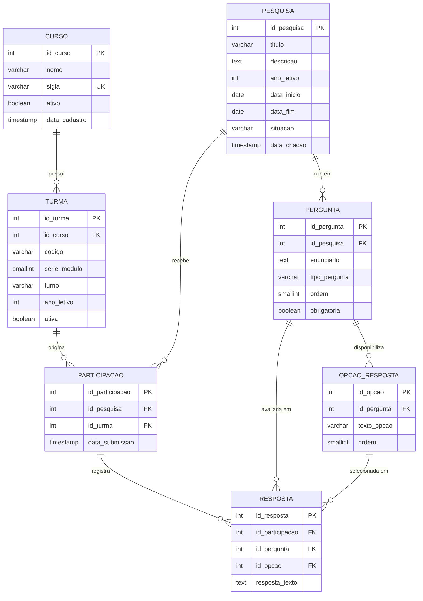

# Sistema de Levantamento de Perfil Esportivo Escolar — Mapa Esportivo

**Projeto de Engenharia de Software / Análise de Sistemas**

**Instituição:** Escola Técnica Estadual Chico Science (ETE Chico Science — Olinda/PE)  
**Disciplina:** Engenharia de Software / Análise e Projeto de Sistemas / Banco de Dados  
**Período:** 2026.2  

---

## 1. Análise Crítica Inicial do Escopo

### 1.1. Proposta do Sistema

O **Mapa Esportivo** é um sistema web de levantamento censitário e diagnóstico de perfil esportivo escolar concebido para a **Escola Técnica Estadual Chico Science (ETE Chico Science)**, em Olinda/PE. O objetivo central é solucionar a **ausência de dados estruturados e consolidados sobre a prática de atividades físicas, interesses esportivos e barreiras enfrentadas pelos estudantes**.

Tradicionalmente, a elaboração do plano pedagógico de Educação Física, a oferta de projetos extracurriculares e a organização de jogos escolares ocorrem sem uma base estatística representativa. O Mapa Esportivo provê uma plataforma para a aplicação de questionários periódicos e a geração de consultas analíticas sobre hábitos e demandas esportivas discentes.

O foco é o **gerenciamento de pesquisas, coleta desidentificada de respostas e visualização de indicadores agregados**, sem envolver módulos de academia, prescrição individual de treinos, cobranças financeiras ou controle de portaria.

---

### 1.2. Entidades Consideradas Necessárias

A modelagem de dados é composta por **7 entidades** essenciais:

1. **Curso** — cadastro dos cursos técnicos da instituição (ex.: *Desenvolvimento de Sistemas*, *Redes de Computadores*, *Administração*).
2. **Turma** — agrupamento escolar (ano/módulo, turno e ano letivo) vinculado a um curso, viabilizando análises de corte demográfico por grupo.
3. **Pesquisa** — edições do censo esportivo, com título, descrição, período de vigência e situação operacional.
4. **Pergunta** — questões que estruturam a pesquisa, definindo enunciado, ordem, obrigatoriedade e tipo de resposta (`unica_escolha`, `multipla_escolha`, `texto_livre`, `escala`).
5. **Opcao_Resposta** — alternativas pré-cadastradas para perguntas fechadas.
6. **Participacao** — registro da sessão de preenchimento de um estudante, vinculada à turma e data/hora de envio, preservando o anonimato individual.
7. **Resposta** — dado fornecido para cada pergunta em uma participação, associando a opção selecionada ou o texto digitado.

---

### 1.3. Funcionalidades Incluídas

- Gerenciamento de cursos e turmas da escola;
- Criação e controle de vigência de pesquisas (`planejada`, `aberta`, `encerrada`);
- Composição flexível de questionários com perguntas de múltiplos tipos;
- Cadastro ordenado de opções de resposta;
- Formulário público de preenchimento desidentificado (sem necessidade de login individual);
- Gravação transacional atômica de participações e respostas;
- Consultas analíticas consolidadas:
  - Total de participantes por turma, curso e turno;
  - Proporção de estudantes praticantes vs. não praticantes de esportes;
  - Distribuição por faixa de frequência semanal;
  - Ranking de modalidades mais praticadas e de maior interesse na escola;
  - Mapeamento das principais barreiras relatadas.

---

### 1.4. Funcionalidades Deliberadamente Excluídas

- **Identificação nominal / CPF de estudantes**: a coleta é não nominal (desidentificada), garantindo a privacidade dos alunos e estimulando respostas sinceras sobre sedentarismo ou dificuldades;
- **Prescrição de treinos e fichas de musculação**: conceito exclusivo de academias, alheio ao censo escolar;
- **Módulos financeiros e controle de mensalidades**: incompatíveis com o ensino público estadual gratuito;
- **Integração com catracas e biometria**: desnecessárias para levantamentos por amostragem;
- **Aplicativos móveis nativos e inteligência artificial preditiva**: adicionariam complexidade técnica desnecessária sem ganho direto para a gestão escolar.

---

### 1.5. Regras de Negócio Fundamentais

- Uma pesquisa só recebe respostas enquanto estiver com situação `aberta` e dentro do período de vigência;
- A participação discente não coleta dados de identificação pessoal direta, registrando apenas a turma para agrupamento pedagógico;
- Perguntas obrigatórias exigem resposta válida para que a submissão seja processada;
- **Integridade de Opção (RN08)**: Toda resposta vinculada a uma alternativa (`id_opcao`) deve obrigatoriamente pertencer à pergunta correspondente (`id_pergunta`), garantida por chave estrangeira composta no banco de dados;
- **Compatibilidade Semântica de Conteúdo (RN13)**: Perguntas objetivas devem conter `id_opcao` preenchido e `resposta_texto` nulo; perguntas abertas devem conter `resposta_texto` preenchido e `id_opcao` nulo;
- Não é permitida a alteração estrutural de questionários de pesquisas que já possuam participações registradas.

---

### 1.6. Principais Decisões de Simplificação

1. **Coleta Desidentificada com Estratificação por Turma**: dispensa módulos complexos de gestão de contas de alunos, mantendo o processo ágil e em conformidade com a LGPD;
2. **Chave Estrangeira Composta para Integridade de Opções**: o par `(id_pergunta, id_opcao)` em `resposta` referencia `(id_pergunta, id_opcao)` em `opcao_resposta`, impedindo que uma opção de outra pergunta seja vinculada indevidamente;
3. **Flexibilidade de Série/Módulo**: amplitude de 1 a 5 para contemplar tanto cursos técnicos integrados ao Ensino Médio (1º ao 3º ano) quanto cursos subsequentes/concomitantes modulares (módulos 1 a 4);
4. **PostgreSQL**: utilização de recursos relacionais padrão (chaves estrangeiras compostas, constraints `CHECK` e `UNIQUE`, índices btree).

---

## 2. Integrantes

| Nome | Matrícula |
|---|---|
| Juan Alencar de Barros | 01621647 |
| Allan Victor Cavalcanti de Sá | 01587571 |
| Fabiano Vitor de Holanda Coelho | 01647936 |
| João Guilherme Nemesio Beltrão | 01591539 |
| Matheus Henrique Souto Dosquinha | 01604657 |
| Ruan Deud Rameh de Oliveira | 01647036 |

---

## 3. Introdução

O presente documento detalha a especificação de requisitos, regras de negócio e modelagem de banco de dados do sistema **Mapa Esportivo**, desenvolvido para a **Escola Técnica Estadual Chico Science (ETE Chico Science)**, localizada em Olinda/PE.

A prática de atividades físicas é um elemento essencial para a saúde e o desenvolvimento integral dos estudantes. Para que as iniciativas esportivas da instituição sejam efetivas, é necessário diagnosticar com precisão os hábitos, os anseios e as limitações da comunidade discente.

O Mapa Esportivo atua como ferramenta de apoio à gestão escolar e aos professores de Educação Física, viabilizando a aplicação de pesquisas diagnósticas periódicas e a consulta a indicadores consolidados para o planejamento educacional.

---

## 4. Contextualização do Problema

A ETE Chico Science conta com centenas de estudantes matriculados em cursos técnicos integrados e subsequentes. A instituição enfrenta dificuldades no planejamento de suas atividades esportivas decorrentes de:

1. **Descompasso de Modalidades**: oferta de atividades esportivas baseada em tradição, sem consulta periódica sobre novos interesses (futsal, vôlei, dança, lutas, calistenia);
2. **Falta de Diagnóstico de Barreiras**: ausência de dados consolidados sobre as razões que limitam a participação esportiva (tempo, espaço, materiais ou companhia);
3. **Limitações de Instrumentos Manuais**: perda de dados e retrabalho na consolidação de questionários impressos;
4. **Viés por Falta de Privacidade**: estudantes sedentários ou com dificuldades evitam participar de questionários que exigem identificação nominal.

A criação de um sistema de levantamento censitário, com respostas desidentificadas e relatórios agregados, supre essas necessidades com precisão técnica.

---

## 5. Objetivo Geral

Desenvolver a documentação e o modelo de banco de dados relacional em PostgreSQL para o sistema **Mapa Esportivo**, permitindo a gestão de questionários, a coleta desidentificada de respostas de estudantes da ETE Chico Science e a emissão de consultas estatísticas sobre o perfil esportivo escolar.

---

## 6. Objetivos Específicos

1. Especificar os requisitos funcionais e não funcionais do sistema de pesquisa esportiva escolar.
2. Definir regras de negócio rigorosas para validação de dados e integridade referencial.
3. Elaborar o Modelo Entidade-Relacionamento (MER) conceitual.
4. Construir o Modelo Lógico Relacional normalizado em 3FN.
5. Definir o Modelo Físico e o script SQL DDL para PostgreSQL 16+.
6. Implementar integridade estrutural por meio de chaves estrangeiras compostas e constraints declarativas.
7. Validar a consistência integral entre requisitos, regras de negócio e tabelas.

---

## 7. Descrição da Solução Proposta

O sistema divide-se funcionalmente em dois módulos:

- **Painel Administrativo (Acesso Restrito)**: operado pela equipe escolar para gerenciamento de cursos, turmas e pesquisas, estruturação de perguntas e visualização dos indicadores agregados.
- **Formulário de Coleta Discente (Acesso Público)**: interface web simplificada e responsiva em que o estudante seleciona sua turma, responde ao questionário da pesquisa aberta e envia sua participação em poucos minutos, sem necessidade de login.

---

## 8. Escopo do Sistema

### Funcionalidades Incluídas
| # | Funcionalidade | Finalidade |
|---|---|---|
| **F01** | Gerenciar Cursos | Cadastro, edição e ativação/desativação de cursos técnicos. |
| **F02** | Gerenciar Turmas | Organização das turmas por curso, ano/módulo (1..5) e turno. |
| **F03** | Gerenciar Pesquisas | Criação de ciclos de pesquisa com período de vigência. |
| **F04** | Controlar Situação da Pesquisa | Controle de estado (`planejada`, `aberta`, `encerrada`). |
| **F05** | Estruturar Perguntas | Cadastro de perguntas ordenadas, obrigatórias e tipadas. |
| **F06** | Gerenciar Opções de Resposta | Cadastro de alternativas para perguntas fechadas. |
| **F07** | Disponibilizar Questionário | Apresentação do formulário ativo para os alunos. |
| **F08** | Registrar Participação | Gravação da sessão associada à turma e data/hora. |
| **F09** | Gravar Respostas | Armazenamento das opções marcadas ou textos preenchidos. |
| **F10** | Consultar Totalizadores | Quantitativo de participantes por pesquisa, curso e turma. |
| **F11** | Consultar Perfil de Prática | Proporção de alunos praticantes vs. não praticantes e frequências. |
| **F12** | Consultar Ranking de Modalidades | Modalidades mais praticadas e modalidades desejadas na escola. |
| **F13** | Consultar Barreiras Esportivas | Indicadores das principais dificuldades relatadas. |
| **F14** | Filtrar Resultados | Cruzamento analítico por curso, turno e edição de pesquisa. |

### Funcionalidades Excluídas
| Funcionalidade Excluída | Justificativa |
|---|---|
| Identificação nominal de alunos | Preservação do anonimato individual e incentivo à sinceridade nas respostas. |
| Fichas de treino e exercícios de academia | Escopo de academia descartado. |
| Cobranças e pagamentos | Incompatível com instituição pública gratuita. |
| Integração com catracas/biometria | Desnecessária para pesquisa amostral. |
| Aplicativos nativos e IA complexa | Complexidade desproporcional ao objetivo acadêmico. |

---

## 9. Requisitos Funcionais

| ID | Requisito | Descrição / Objetivo |
|---|---|---|
| **RF01** | Cadastrar curso | Permite cadastrar cursos técnicos com nome, sigla e status. |
| **RF02** | Editar curso | Permite alterar dados de cursos cadastrados. |
| **RF03** | Consultar cursos | Permite listar e filtrar cursos por nome, sigla ou status. |
| **RF04** | Cadastrar turma | Permite cadastrar turmas vinculadas a um curso, com código, série/módulo (1..5), turno e ano letivo. |
| **RF05** | Editar turma | Permite alterar dados de turmas existentes. |
| **RF06** | Consultar turmas | Permite filtrar turmas por curso, turno, série ou ano letivo. |
| **RF07** | Criar pesquisa | Permite cadastrar pesquisas com título, descrição, ano letivo, data de início e término. |
| **RF08** | Editar pesquisa | Permite editar pesquisas em estado `planejada` ou `aberta`. |
| **RF09** | Gerenciar situação da pesquisa | Permite transicionar o estado da pesquisa (`planejada`, `aberta`, `encerrada`). |
| **RF10** | Cadastrar pergunta | Permite cadastrar perguntas com enunciado, ordem, obrigatoriedade e tipo (`unica_escolha`, `multipla_escolha`, `texto_livre`, `escala`). |
| **RF11** | Editar pergunta | Permite editar perguntas em pesquisas sem respostas registradas. |
| **RF12** | Cadastrar opções de resposta | Permite cadastrar opções para perguntas fechadas com texto e ordem. |
| **RF13** | Editar opções de resposta | Permite alterar opções em pesquisas sem respostas registradas. |
| **RF14** | Disponibilizar questionário ativo | Permite exibir o questionário completo da pesquisa atualmente aberta. |
| **RF15** | Registrar participação e respostas | Permite ao estudante enviar suas respostas de forma desidentificada, informando apenas a turma. |
| **RF16** | Consultar totalizadores | Permite visualizar a contagem de respostas por curso, turma e turno. |
| **RF17** | Consultar perfil de prática | Permite visualizar percentual de praticantes e faixas de frequência semanal. |
| **RF18** | Consultar ranking de modalidades | Permite visualizar modalidades mais praticadas e mais demandadas na escola. |
| **RF19** | Consultar mapeamento de barreiras | Permite consolidar as principais dificuldades relatadas pelos estudantes. |
| **RF20** | Filtrar indicadores | Permite aplicar filtros cruzados nos resultados por pesquisa, curso e turno. |

---

## 10. Requisitos Não Funcionais

| ID | Categoria | Requisito |
|---|---|---|
| **RNF01** | Privacidade | O sistema deve realizar coleta desidentificada, sem armazenar dados de identificação direta do aluno (nome, CPF, matrícula, e-mail). |
| **RNF02** | Segurança de Acesso | O acesso ao módulo de gestão de pesquisas e relatórios deve exigir autenticação de usuários autorizados. |
| **RNF03** | Integridade Transacional | A submissão da participação e de suas respectivas respostas deve ser executada em transação atômica (ACID). |
| **RNF04** | Usabilidade | A interface do questionário deve ser clara, direta e em português, permitindo o preenchimento rápido sem treinamento prévio. |
| **RNF05** | Responsividade | O sistema deve ser compatível com navegadores web em smartphones, tablets e computadores desktop. |
| **RNF06** | Desempenho | As operações de gravação de respostas e geração de indicadores devem responder com rapidez em conexões escolares comuns. |
| **RNF07** | Integridade Relacional | O banco de dados deve assegurar integridade referencial estrita por meio de chaves estrangeiras e constraints declarativas. |
| **RNF08** | Tecnologia Aberta | O sistema e o banco de dados devem utilizar tecnologias open source gratuitas e amplamente consolidadas (PostgreSQL, React, TypeScript). |

---

## 11. Regras de Negócio

| ID | Regra | Impacto na Modelagem / Implementação |
|---|---|---|
| **RN01** | **Vigência da Pesquisa**: Uma pesquisa só recebe participações se estiver com situação `aberta` e a data atual estiver entre `data_inicio` e `data_fim`. | Constraint `CHECK (data_fim >= data_inicio)` na tabela `pesquisa` e validação na aplicação. |
| **RN02** | **Unicidade de Título/Ano**: Não podem existir duas pesquisas com o mesmo título no mesmo ano letivo. | Constraint `UNIQUE (titulo, ano_letivo)` na tabela `pesquisa`. |
| **RN03** | **Ordem Positiva de Perguntas**: A ordem de uma pergunta na pesquisa deve ser um inteiro estritamente positivo (≥ 1). | Constraint `CHECK (ordem >= 1)` na tabela `pergunta`. |
| **RN04** | **Unicidade de Ordem de Pergunta**: Não podem existir duas perguntas com a mesma ordem dentro da mesma pesquisa. | Constraint `UNIQUE (id_pesquisa, ordem)` na tabela `pergunta`. |
| **RN05** | **Domínio de Tipos de Pergunta**: O tipo de pergunta é restrito a: `unica_escolha`, `multipla_escolha`, `texto_livre` e `escala`. | Constraint `CHECK` na coluna `tipo_pergunta` da tabela `pergunta`. |
| **RN06** | **Mínimo de Opções**: Perguntas de escolha única ou múltipla devem possuir pelo menos duas opções cadastradas antes da abertura da pesquisa. | Validação na camada de aplicação ao alterar o status para `aberta`. |
| **RN07** | **Unicidade de Ordem de Opção**: Não podem existir duas opções com a mesma ordem na mesma pergunta. | Constraint `UNIQUE (id_pergunta, ordem)` na tabela `opcao_resposta`. |
| **RN08** | **Integridade de Opção por Chave Composta**: Toda resposta vinculada a uma opção (`id_opcao`) deve obrigatoriamente referenciar uma alternativa pertencente à própria pergunta (`id_pergunta`). | **Chave estrangeira composta** `FOREIGN KEY (id_pergunta, id_opcao) REFERENCES opcao_resposta(id_pergunta, id_opcao)` na tabela `resposta`. |
| **RN09** | **Exclusividade em Escolha Única**: Perguntas de escolha única admitem no máximo uma opção de resposta por participação. | Validação na montagem da transação na aplicação. |
| **RN10** | **Preenchimento de Questões Obrigatórias**: Perguntas com `obrigatoria = TRUE` exigem resposta válida na submissão. | Validação na aplicação antes da gravação. |
| **RN11** | **Bloqueio de Modificação Estrutural**: Não é permitido alterar perguntas ou opções em pesquisas que já contenham participações registradas. | Validação na aplicação e integridade `RESTRICT` nas chaves estrangeiras. |
| **RN12** | **Vinculação à Turma**: Toda participação deve estar vinculada a uma turma ativa cadastrada. | Chave estrangeira `id_turma` NOT NULL na tabela `participacao`. |
| **RN13** | **Compatibilidade Semântica de Conteúdo**: Respostas a perguntas objetivas devem conter `id_opcao` preenchido e `resposta_texto` nulo; respostas a perguntas abertas devem conter `resposta_texto` preenchido e `id_opcao` nulo. | Constraint `CHECK (id_opcao IS NOT NULL OR resposta_texto IS NOT NULL)` no banco e validação de tipo na aplicação. |
| **RN14** | **Restrição de Exclusão**: Cursos com turmas e turmas com participações não podem ser excluídos fisicamente. | Cláusula `ON DELETE RESTRICT` nas chaves estrangeiras. |

---

## 12. Modelo Conceitual — MER

### 12.1. Entidades e Relacionamentos
- **Curso** (1:N) **Turma**
- **Turma** (1:N) **Participacao**
- **Pesquisa** (1:N) **Participacao**
- **Pesquisa** (1:N) **Pergunta**
- **Pergunta** (1:N) **Opcao_Resposta**
- **Participacao** (1:N) **Resposta**
- **Pergunta** (1:N) **Resposta**
- **Opcao_Resposta** (1:N) **Resposta**

### 12.2. Diagrama MER (Mermaid)



---

## 13. Descrição das Entidades e Atributos

### 13.1. Curso
| Atributo | Tipo | Restrições | Descrição |
|---|---|---|---|
| `id_curso` | SERIAL | PRIMARY KEY | Identificador único do curso. |
| `nome` | VARCHAR(120) | NOT NULL | Nome do curso técnico. |
| `sigla` | VARCHAR(10) | NOT NULL, UNIQUE | Sigla única (ex.: "DS", "REDES"). |
| `ativo` | BOOLEAN | NOT NULL, DEFAULT TRUE | Status operacional. |
| `data_cadastro` | TIMESTAMPTZ | NOT NULL, DEFAULT NOW | Data de cadastro. |

### 13.2. Turma
| Atributo | Tipo | Restrições | Descrição |
|---|---|---|---|
| `id_turma` | SERIAL | PRIMARY KEY | Identificador único da turma. |
| `id_curso` | INTEGER | FK → `curso`, NOT NULL | Curso técnico vinculado. |
| `codigo` | VARCHAR(20) | NOT NULL | Código identificador (ex.: "1º DS A"). |
| `serie_modulo` | SMALLINT | NOT NULL, CHECK (1..5) | Ano (1..3) ou módulo (1..4) do curso. |
| `turno` | VARCHAR(15) | NOT NULL, CHECK | `manha`, `tarde`, `integral`, `noite`. |
| `ano_letivo` | INTEGER | NOT NULL, CHECK (>= 2020) | Ano letivo de vigência. |
| `ativa` | BOOLEAN | NOT NULL, DEFAULT TRUE | Situação da turma. |

### 13.3. Pesquisa
| Atributo | Tipo | Restrições | Descrição |
|---|---|---|---|
| `id_pesquisa` | SERIAL | PRIMARY KEY | Identificador único da pesquisa. |
| `titulo` | VARCHAR(150) | NOT NULL | Título da pesquisa. |
| `descricao` | TEXT | NULL | Texto explicativo. |
| `ano_letivo` | INTEGER | NOT NULL, CHECK (>= 2020) | Ano letivo de aplicação. |
| `data_inicio` | DATE | NOT NULL | Início da coleta. |
| `data_fim` | DATE | NOT NULL | Término da coleta (>= data_inicio). |
| `situacao` | VARCHAR(15) | NOT NULL, DEFAULT 'planejada' | `planejada`, `aberta`, `encerrada`. |
| `data_criacao` | TIMESTAMPTZ | NOT NULL, DEFAULT NOW | Data de criação. |

### 13.4. Pergunta
| Atributo | Tipo | Restrições | Descrição |
|---|---|---|---|
| `id_pergunta` | SERIAL | PRIMARY KEY | Identificador único da pergunta. |
| `id_pesquisa` | INTEGER | FK → `pesquisa`, NOT NULL | Pesquisa correspondente. |
| `enunciado` | TEXT | NOT NULL | Texto da questão. |
| `tipo_pergunta` | VARCHAR(20) | NOT NULL, CHECK | `unica_escolha`, `multipla_escolha`, `texto_livre`, `escala`. |
| `ordem` | SMALLINT | NOT NULL, CHECK (>= 1) | Ordem de exibição. |
| `obrigatoria` | BOOLEAN | NOT NULL, DEFAULT TRUE | Obrigatoriedade de resposta. |

### 13.5. Opcao_Resposta
| Atributo | Tipo | Restrições | Descrição |
|---|---|---|---|
| `id_opcao` | SERIAL | PRIMARY KEY | Identificador único da alternativa. |
| `id_pergunta` | INTEGER | FK → `pergunta`, NOT NULL | Pergunta à qual a opção pertence. |
| `texto_opcao` | VARCHAR(200) | NOT NULL | Texto descritivo da opção. |
| `ordem` | SMALLINT | NOT NULL, CHECK (>= 1) | Ordem de exibição. |

> **Garantia Relacional (RN08)**: A tabela possui constraint `UNIQUE (id_pergunta, id_opcao)`, permitindo que a tabela `resposta` referencie a chave composta `(id_pergunta, id_opcao)`, garantindo que uma opção não possa ser associada a outra pergunta.

### 13.6. Participacao
| Atributo | Tipo | Restrições | Descrição |
|---|---|---|---|
| `id_participacao` | SERIAL | PRIMARY KEY | Identificador único da sessão. |
| `id_pesquisa` | INTEGER | FK → `pesquisa`, NOT NULL | Pesquisa respondida. |
| `id_turma` | INTEGER | FK → `turma`, NOT NULL | Turma informada (estratificação). |
| `data_submissao` | TIMESTAMPTZ | NOT NULL, DEFAULT NOW | Data/hora do envio. |

### 13.7. Resposta
| Atributo | Tipo | Restrições | Descrição |
|---|---|---|---|
| `id_resposta` | SERIAL | PRIMARY KEY | Identificador único da resposta. |
| `id_participacao` | INTEGER | FK → `participacao`, NOT NULL | Participação correspondente. |
| `id_pergunta` | INTEGER | FK → `pergunta`, NOT NULL | Pergunta respondida. |
| `id_opcao` | INTEGER | FK Composta → `opcao_resposta`, NULL | Opção escolhida (perguntas objetivas). |
| `resposta_texto` | TEXT | NULL | Texto digitado (perguntas abertas). |

---

## 14. Modelo Lógico Relacional

- **`curso`** (`id_curso` [PK], `nome`, `sigla` [UK], `ativo`, `data_cadastro`)
- **`turma`** (`id_turma` [PK], `id_curso` [FK → `curso`], `codigo`, `serie_modulo`, `turno`, `ano_letivo`, `ativa`) — *UK: (`id_curso`, `codigo`, `ano_letivo`)*
- **`pesquisa`** (`id_pesquisa` [PK], `titulo`, `descricao`, `ano_letivo`, `data_inicio`, `data_fim`, `situacao`, `data_criacao`) — *UK: (`titulo`, `ano_letivo`)*
- **`pergunta`** (`id_pergunta` [PK], `id_pesquisa` [FK → `pesquisa`], `enunciado`, `tipo_pergunta`, `ordem`, `obrigatoria`) — *UK: (`id_pesquisa`, `ordem`)*
- **`opcao_resposta`** (`id_opcao` [PK], `id_pergunta` [FK → `pergunta`], `texto_opcao`, `ordem`) — *UK: (`id_pergunta`, `ordem`), UK: (`id_pergunta`, `id_opcao`)*
- **`participacao`** (`id_participacao` [PK], `id_pesquisa` [FK → `pesquisa`], `id_turma` [FK → `turma`], `data_submissao`)
- **`resposta`** (`id_resposta` [PK], `id_participacao` [FK → `participacao`], `id_pergunta` [FK → `pergunta`], `id_opcao` [FK Composta → `opcao_resposta(id_pergunta, id_opcao)`], `resposta_texto`)

---

## 15. Normalização e Justificativas

O modelo atende integralmente às três primeiras formas normais:
- **1FN**: valores atômicos em todas as colunas; ausência de arrays ou listas concatenadas em campos; cada seleção múltipla gera uma tupla individual na tabela `resposta`.
- **2FN**: chaves primárias simples baseadas em `SERIAL`, eliminando por definição qualquer dependência funcional parcial.
- **3FN**: ausência de dependências transitivas; dados de turmas, cursos e textos de opções são recuperados exclusivamente por `JOIN`.
- **Desnormalização**: Nenhuma desnormalização foi adotada, mantendo o modelo enxuto e consistente.

---

## 16. Modelo Físico

- **SGBD**: PostgreSQL 16+
- **Mapeamento de Tipos de Dados**:
  - `SERIAL`: chaves primárias inteiras autoincrementadas.
  - `SMALLINT`: números de pequeno alcance (`serie_modulo` de 1 a 5, ordens sequenciais).
  - `VARCHAR(n)`: strings com tamanho máximo previsível (sigla, código, turno, status).
  - `TEXT`: enunciados de perguntas, descrições e respostas abertas de texto livre.
  - `DATE`: datas de vigência da pesquisa (`data_inicio`, `data_fim`).
  - `TIMESTAMPTZ`: carimbo de data e hora com fuso horário para submissões e cadastros.
  - `BOOLEAN`: flags de ativação e obrigatoriedade.

---

## 17. Estrutura Física das Tabelas e Índices

### Índices Criados
- `idx_turma_curso` em `turma(id_curso)`
- `idx_pesquisa_situacao` em `pesquisa(situacao)`
- `idx_pergunta_pesquisa` em `pergunta(id_pesquisa, ordem)`
- `idx_opcao_pergunta` em `opcao_resposta(id_pergunta, ordem)`
- `idx_participacao_pesquisa` em `participacao(id_pesquisa)`
- `idx_participacao_turma` em `participacao(id_turma)`
- `idx_resposta_participacao` em `resposta(id_participacao)`
- `idx_resposta_pergunta_opcao` em `resposta(id_pergunta, id_opcao)`

---

## 18. SQL de Criação do Banco (DDL Completo)

```sql
-- ============================================================
-- Mapa Esportivo — Sistema de Levantamento de Perfil Esportivo
-- Instituição: Escola Técnica Estadual Chico Science (Olinda/PE)
-- SGBD: PostgreSQL 16+
-- Script DDL de Criação do Banco de Dados
-- ============================================================

SET client_encoding = 'UTF8';
SET standard_conforming_strings = on;

-- 1. TABELA: curso
CREATE TABLE curso (
    id_curso       SERIAL       PRIMARY KEY,
    nome           VARCHAR(120) NOT NULL,
    sigla          VARCHAR(10)  NOT NULL UNIQUE,
    ativo          BOOLEAN      NOT NULL DEFAULT TRUE,
    data_cadastro  TIMESTAMPTZ  NOT NULL DEFAULT CURRENT_TIMESTAMP
);

-- 2. TABELA: turma
CREATE TABLE turma (
    id_turma       SERIAL       PRIMARY KEY,
    id_curso       INTEGER      NOT NULL REFERENCES curso(id_curso) ON DELETE RESTRICT,
    codigo         VARCHAR(20)  NOT NULL,
    serie_modulo   SMALLINT     NOT NULL CHECK (serie_modulo BETWEEN 1 AND 5),
    turno          VARCHAR(15)  NOT NULL CHECK (turno IN ('manha', 'tarde', 'integral', 'noite')),
    ano_letivo     INTEGER      NOT NULL CHECK (ano_letivo >= 2020),
    ativa          BOOLEAN      NOT NULL DEFAULT TRUE,
    CONSTRAINT uq_turma_curso_codigo_ano UNIQUE (id_curso, codigo, ano_letivo)
);

CREATE INDEX idx_turma_curso ON turma (id_curso);

-- 3. TABELA: pesquisa
CREATE TABLE pesquisa (
    id_pesquisa    SERIAL       PRIMARY KEY,
    titulo         VARCHAR(150) NOT NULL,
    descricao      TEXT,
    ano_letivo     INTEGER      NOT NULL CHECK (ano_letivo >= 2020),
    data_inicio    DATE         NOT NULL,
    data_fim       DATE         NOT NULL,
    situacao       VARCHAR(15)  NOT NULL DEFAULT 'planejada' 
                                CHECK (situacao IN ('planejada', 'aberta', 'encerrada')),
    data_criacao   TIMESTAMPTZ  NOT NULL DEFAULT CURRENT_TIMESTAMP,
    CONSTRAINT chk_pesquisa_datas CHECK (data_fim >= data_inicio),
    CONSTRAINT uq_pesquisa_titulo_ano UNIQUE (titulo, ano_letivo)
);

CREATE INDEX idx_pesquisa_situacao ON pesquisa (situacao);

-- 4. TABELA: pergunta
CREATE TABLE pergunta (
    id_pergunta    SERIAL       PRIMARY KEY,
    id_pesquisa    INTEGER      NOT NULL REFERENCES pesquisa(id_pesquisa) ON DELETE RESTRICT,
    enunciado      TEXT         NOT NULL,
    tipo_pergunta  VARCHAR(20)  NOT NULL 
                                CHECK (tipo_pergunta IN ('unica_escolha', 'multipla_escolha', 'texto_livre', 'escala')),
    ordem          SMALLINT     NOT NULL CHECK (ordem >= 1),
    obrigatoria    BOOLEAN      NOT NULL DEFAULT TRUE,
    CONSTRAINT uq_pergunta_pesquisa_ordem UNIQUE (id_pesquisa, ordem)
);

CREATE INDEX idx_pergunta_pesquisa ON pergunta (id_pesquisa, ordem);

-- 5. TABELA: opcao_resposta
CREATE TABLE opcao_resposta (
    id_opcao       SERIAL       PRIMARY KEY,
    id_pergunta    INTEGER      NOT NULL REFERENCES pergunta(id_pergunta) ON DELETE RESTRICT,
    texto_opcao    VARCHAR(200) NOT NULL,
    ordem          SMALLINT     NOT NULL CHECK (ordem >= 1),
    CONSTRAINT uq_opcao_pergunta_ordem UNIQUE (id_pergunta, ordem),
    CONSTRAINT uq_opcao_pergunta_id UNIQUE (id_pergunta, id_opcao)
);

CREATE INDEX idx_opcao_pergunta ON opcao_resposta (id_pergunta, ordem);

-- 6. TABELA: participacao
CREATE TABLE participacao (
    id_participacao SERIAL      PRIMARY KEY,
    id_pesquisa     INTEGER     NOT NULL REFERENCES pesquisa(id_pesquisa) ON DELETE RESTRICT,
    id_turma        INTEGER     NOT NULL REFERENCES turma(id_turma) ON DELETE RESTRICT,
    data_submissao  TIMESTAMPTZ NOT NULL DEFAULT CURRENT_TIMESTAMP
);

CREATE INDEX idx_participacao_pesquisa ON participacao (id_pesquisa);
CREATE INDEX idx_participacao_turma    ON participacao (id_turma);

-- 7. TABELA: resposta
-- Note: A chave estrangeira composta (id_pergunta, id_opcao) garante a regra RN08 no nível físico
CREATE TABLE resposta (
    id_resposta     SERIAL      PRIMARY KEY,
    id_participacao INTEGER     NOT NULL REFERENCES participacao(id_participacao) ON DELETE RESTRICT,
    id_pergunta     INTEGER     NOT NULL REFERENCES pergunta(id_pergunta) ON DELETE RESTRICT,
    id_opcao        INTEGER,
    resposta_texto  TEXT,
    CONSTRAINT chk_resposta_conteudo CHECK (id_opcao IS NOT NULL OR resposta_texto IS NOT NULL),
    CONSTRAINT fk_resposta_opcao_pergunta 
        FOREIGN KEY (id_pergunta, id_opcao) 
        REFERENCES opcao_resposta(id_pergunta, id_opcao) 
        ON DELETE RESTRICT
);

CREATE INDEX idx_resposta_participacao     ON resposta (id_participacao);
CREATE INDEX idx_resposta_pergunta_opcao    ON resposta (id_pergunta, id_opcao);
```

---

## 19. Validação de Consistência e Auditoria Reexecutada

1. **Requisitos × Tabelas**: Todos os 20 requisitos funcionais possuem mapeamento direto nas 7 tabelas.
2. **Garantia Relacional da RN08**: A chave estrangeira composta `FOREIGN KEY (id_pergunta, id_opcao) REFERENCES opcao_resposta(id_pergunta, id_opcao)` impede fisicamente no SGBD que uma opção de outra pergunta seja vinculada à resposta.
3. **Consistência da RN13**: A constraint `CHECK (id_opcao IS NOT NULL OR resposta_texto IS NOT NULL)` assegura presença de conteúdo, enquanto a validação semântica de tipos (`unica_escolha`/`multipla_escolha` exigindo `id_opcao` e `texto_livre` exigindo `resposta_texto`) é garantida na camada de aplicação antes da persistência.
4. **Adequação do Anonimato**: Terminologia revisada para **"coleta desidentificada / preservação do anonimato individual com agregação por turma"**, alinhada com as boas práticas metodológicas e a LGPD.
5. **Simplificação dos RNFs**: Os requisitos não funcionais foram redefinidos de forma concisa e objetiva (privacidade, segurança administrativa, atomicidade transacional, usabilidade, responsividade, desempenho e integridade relacional).
6. **Flexibilidade de Turmas**: O campo `serie_modulo` foi ampliado para o intervalo `1..5`, suportando turmas de Ensino Médio Integrado (anos 1 a 3) e cursos subsequentes/concomitantes modulares (módulos 1 a 4).
7. **Normalização e Integridade**: Esquema rigorosamente em 3FN, com chaves estrangeiras protegidas por `ON DELETE RESTRICT`.

---

## 20. Conclusão

O documento acadêmico do **Mapa Esportivo** foi inteiramente reconstruído para refletir com fidelidade as necessidades da **ETE Chico Science**.

Com 20 requisitos funcionais, 8 requisitos não funcionais objetivos, 14 regras de negócio e um banco de dados relacional em PostgreSQL composto por 7 tabelas em 3FN, o sistema oferece uma solução robusta, simples e plenamente viável para execução em ambiente acadêmico.
