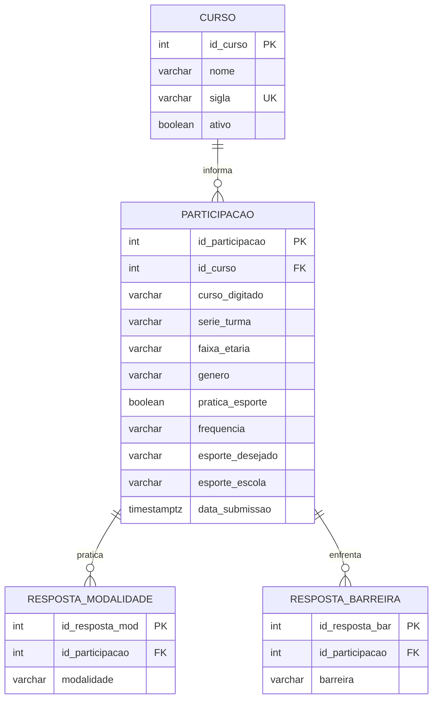

# Especificação de Requisitos e Modelagem de Dados — Mapa Esportivo

**Sistema de Levantamento e Diagnóstico de Perfil Esportivo Escolar**  
**Instituição:** Escola Técnica Estadual Chico Science (ETE Chico Science — Olinda/PE)  
**Projeto:** Engenharia de Software / Análise de Sistemas / Banco de Dados  
**Ano/Período:** 2026.2  

---

## 1. O que é o Projeto

### 1.1. Definição do Sistema
O **Mapa Esportivo** é uma plataforma web institucional de levantamento censitário e diagnóstico analítico sobre a prática de atividades físicas, interesses esportivos e barreiras enfrentadas pelos estudantes da **Escola Técnica Estadual Chico Science (ETE Chico Science)**, localizada em Olinda/PE.

### 1.2. Contexto Institucional
A ETE Chico Science é uma escola pública estadual de Educação Profissional e Tecnológica focada prioritariamente na área de saúde, oferecendo cursos técnicos integrados ao Ensino Médio:
- **Técnico em Nutrição e Dietética**
- **Técnico em Farmácia**
- **Técnico em Enfermagem**
- Possibilidade de acolhimento de outras turmas ou cursos correlatos mediante identificação textual direta no sistema.

As turmas contempladas no diagnóstico correspondem aos três anos do Ensino Médio Integrado (**1º Ano**, **2º Ano** e **3º Ano**).

### 1.3. Problema que o Projeto Resolve
Tradicionalmente, a elaboração do plano pedagógico de Educação Física, a oferta de escolinhas esportivas, oficinas extracurriculares e os Jogos Escolares ocorrem sem uma base estatística representativa. Isso acarreta:
1. **Descompasso de modalidades**: oferta pautada em tradição (apenas futsal/vôlei) sem aferir demandas reais como dança, artes marciais, musculação ou calistenia;
2. **Falta de diagnóstico de barreiras**: desconhecimento dos reais fatores que limitam os discentes (falta de tempo, espaço escolar inadequado, custos, falta de equipamentos ou companhia);
3. **Inviabilidade de pesquisas em papel**: perda de dados, custo de impressão e demora na tabulação manual;
4. **Viés por falta de privacidade**: alunos sedentários evitam preencher questionários que exijam nome ou matrícula.

O Mapa Esportivo provê um **questionário discente digital desidentificado (100% anônimo)** e um **painel analítico (dashboard) em tempo real** para orientar gestores e professores com base em evidências estatísticas.

---

## 2. Requisitos Funcionais (RF)

| Código | Nome | Descrição Objetiva |
|---|---|---|
| **RF01** | Coleta de Perfil Demográfico | O sistema deve coletar do estudante: Curso Técnico, Série/Turma, Faixa Etária e Gênero, sem exigir identificadores pessoais (nome, CPF, matrícula). |
| **RF02** | Seleção e Digitação de Curso | O sistema deve disponibilizar como primeiras opções os cursos oficiais da instituição (`Nutrição e Dietética`, `Farmácia`, `Enfermagem`), a opção `Outro` e, caso `Outro` seja selecionado, exibir um campo de texto obrigatório para digitação livre do curso (2 a 80 caracteres). |
| **RF03** | Seleção de Série / Turma | O sistema deve restringir a seleção de série/turma exclusivamente às opções do Ensino Médio Integrado: `1º Ano`, `2º Ano` e `3º Ano`. |
| **RF04** | Coleta de Prática Esportiva Atual | O sistema deve permitir ao estudante declarar objetivamente se pratica atualmente alguma atividade física ("Sim, pratico" ou "Não pratico"). |
| **RF05** | Seleção de Modalidades Praticadas | O sistema deve permitir ao estudante marcar uma ou múltiplas modalidades que pratica (`Futebol`, `Vôlei`, `Futsal`, `Basquete`, `Corrida/caminhada`, `Ciclismo`, `Musculação/academia`, `Dança`, `Artes marciais`, `Outro`). |
| **RF06** | Coleta de Frequência Semanal | O sistema deve registrar a regularidade semanal de prática (`Todos os dias`, `4–6 vezes por semana`, `2–3 vezes por semana`, `1 vez por semana`, `Menos de 1 vez por semana` ou `Não pratico`). |
| **RF07** | Condicionalidade de Prática | Caso o estudante informe que não pratica atividade física (RF04 = falso), o sistema deve desativar as perguntas de modalidades e fixar a frequência em `Não pratico`. |
| **RF08** | Coleta de Interesse Pessoal | O sistema deve permitir ao estudante selecionar a modalidade que ele mais gostaria de praticar ou aprender. |
| **RF09** | Coleta de Barreiras e Dificuldades | O sistema deve permitir a seleção múltipla de fatores limitantes (`Falta de tempo`, `Falta de espaço`, `Falta de equipamentos`, `Falta de dinheiro`, `Falta de companhia`, `Falta de oportunidade na escola`, `Falta de interesse`, `Outro`) ou a opção exclusiva `Nada dificulta`. |
| **RF10** | Coleta de Demanda Esportiva Escolar | O sistema deve permitir ao estudante indicar qual modalidade ele mais gostaria de ver oferecida no espaço ou projetos da ETE Chico Science. |
| **RF11** | Submissão e Gravação Atômica | O sistema deve validar e persistir a resposta em operação atômica, refletindo a atualização imediata nos indicadores agregados do painel. |
| **RF12** | Painel de Indicadores Gerais (KPIs) | O painel deve exibir em cards: Total de Respostas, Taxa e Contagem de Praticantes, Taxa e Contagem de Não Praticantes e Modalidade com Maior Interesse. |
| **RF13** | Gráficos de Distribuição Demográfica | O painel deve apresentar gráficos em barras horizontais detalhando a distribuição de respondentes por: Curso, Gênero, Série e Faixa Etária. |
| **RF14** | Gráficos de Diagnóstico Esportivo | O painel deve apresentar gráficos analíticos de: Modalidades Mais Praticadas, Frequência Semanal, Interesses Pessoais, Demandas para a Escola e Principais Dificuldades. |
| **RF15** | Gráfico de Adesão Geral | O painel deve apresentar barra comparativa de progresso destacando a proporção de estudantes ativos versus não praticantes. |
| **RF16** | Estado Vazio Amigável | Quando não houver respostas gravadas no banco de dados, o sistema deve exibir uma tela inicial limpa com convite à participação e pré-visualização das dimensões analisadas. |

---

## 3. Requisitos Não Funcionais (RNF)

| Código | Categoria | Descrição Objetiva |
|---|---|---|
| **RNF01** | Responsividade Completa | A interface deve ser 100% responsiva (Mobile-First), adaptando-se sem rolagem horizontal ou quebra de elementos em telas com largura a partir de 320px (smartphones compactos) até 1920px+ (desktops). |
| **RNF02** | Privacidade e Anonimato (LGPD) | O sistema deve operar sob coleta estritamente desidentificada, sem registrar nome, CPF, e-mail, telefone, matrícula ou endereço IP do estudante, garantindo total conformidade com a Lei Geral de Proteção de Dados. |
| **RNF03** | Usabilidade e Touch Targets | Todos os botões, checkboxes e seletores devem possuir altura mínima de toque de 44px a 48px em dispositivos móveis, com feedback tátil e visual de seleção imediata. |
| **RNF04** | Desempenho e Tempo de Carregamento | O tempo de carregamento da página (First Contentful Paint) deve ser inferior a 1,5 segundos em conexões 4G escolares, e o processamento de envio deve ocorrer em menos de 800ms. |
| **RNF05** | Consistência e Atomicidade Transacional | A submissão da pesquisa e o incremento dos contadores de estatísticas devem ser executados em transação única atômica (ACID), evitando contagens divergentes ou inconsistências de concorrência. |
| **RNF06** | Acessibilidade Visual | A paleta de cores deve atender aos critérios de contraste WCAG AA/AAA, associando textos informativos, ícones semânticos e rótulos acessíveis para leitores de tela (`aria-label`, `sr-only`). |
| **RNF07** | Segurança de Regras no Servidor | O acesso aos dados e a gravação de documentos no banco devem ser validados por regras de segurança no servidor (`firestore.rules` ou constraints SQL), rejeitando campos extras ou valores fora dos domínios aceitos. |
| **RNF08** | Disponibilidade e Resiliência | A aplicação deve ser servida via CDN global de alta disponibilidade (Firebase Hosting com HTTPS obrigatório e TLS 1.3), suportando picos de acessos simultâneos nas salas de aula. |

---

## 4. Regras de Negócio (RN)

| Código | Regra | Detalhamento e Implementação |
|---|---|---|
| **RN01** | **Validação de Curso Técnico** | O curso informado deve ser um dos cursos de saúde oficiais (`Nutrição e Dietética`, `Farmácia`, `Enfermagem`) ou, se for selecionada a opção `Outro`, deve ser fornecido um texto com no mínimo 2 e no máximo 80 caracteres. |
| **RN02** | **Restrição de Série/Turma** | A série do estudante deve pertencer exclusivamente ao conjunto: `['1º Ano', '2º Ano', '3º Ano']`. Nenhuma outra série ou módulo é aceita. |
| **RN03** | **Domínio de Idade e Gênero** | A faixa etária é restrita a `['14 a 15 anos', '16 a 17 anos', '18 anos ou mais']`. O gênero deve pertencer a `['Feminino', 'Masculino', 'Outro', 'Prefiro não informar']`. |
| **RN04** | **Lógica Condicional de Prática** | Se o aluno responder que não pratica atividades (`practicesSport = false`), a lista de modalidades praticadas deve ser gravada vazia (`[]`) e a frequência deve ser compulsoriamente registrada como `'Não pratico'`. |
| **RN05** | **Exclusividade da Barreira "Nada dificulta"** | A opção `'Nada dificulta'` é mutuamente exclusiva. Não é permitido combiná-la com qualquer outra dificuldade. Se selecionada, todas as outras barreiras são desmarcadas; se outra for marcada, ela é desfeita. |
| **RN06** | **Obrigatoriedade Mínima de Preenchimento** | O formulário só pode ser enviado se: (a) Curso for válido; (b) Turma, Idade e Gênero forem selecionados; (c) Caso pratique esportes, pelo menos uma modalidade atual for assinalada; (d) Pelo menos uma barreira (ou "Nada dificulta") for assinalada. |
| **RN07** | **Atomicidade do Censo** | Toda nova resposta submetida deve somar imediatamente (+1) ao total de respostas e incrementar os respectivos contadores demográficos e esportivos no documento de estatísticas via transação direta. |
| **RN08** | **Imutabilidade e Não Exclusão Pública** | O cliente web público não possui privilégios de alteração (`update`) nem de exclusão (`delete`) sobre as respostas salvas, impedindo fraudes ou manipulação dos resultados coletados. |

---

## 5. Detalhamento do Banco de Dados

O projeto contempla duas implementações técnicas complementares:
1. **Banco de Dados em Produção**: **Firebase Cloud Firestore (NoSQL Document Store)** — ambiente ativo e escalável em produção.
2. **Modelo Relacional Acadêmico**: **PostgreSQL 16+ (SQL Relacional em 3FN)** — modelagem teórica e relacional normalizada com DDL completo.

---

### 5.1. Banco de Dados em Produção (Firebase Cloud Firestore)

#### Coleção 1: `surveyResponses`
Armazena cada registro individual de participação do estudante de forma desidentificada.

- **Caminho:** `/surveyResponses/{responseId}`
- **Estrutura do Documento:**
```json
{
  "course": "Nutrição e Dietética",
  "grade": "1º Ano",
  "ageRange": "16 a 17 anos",
  "gender": "Feminino",
  "practicesSport": true,
  "practicedSports": ["Vôlei", "Corrida/caminhada"],
  "frequency": "2–3 vezes por semana",
  "desiredSport": "Futsal",
  "barriers": ["Falta de tempo", "Falta de espaço"],
  "desiredAtSchool": "Vôlei",
  "createdAt": "TIMESTAMP"
}
```

#### Coleção 2: `dashboardStats`
Armazena o documento consolidado de estatísticas em tempo real, alimentando o dashboard instantaneamente sem exigir varredura completa da coleção a cada visita.

- **Caminho:** `/dashboardStats/current`
- **Estrutura do Documento:**
```json
{
  "totalResponses": 42,
  "practices": { "yes": 29, "no": 13 },
  "courses": [
    { "name": "Nutrição e Dietética", "value": 18 },
    { "name": "Farmácia", "value": 13 },
    { "name": "Enfermagem", "value": 8 },
    { "name": "Outro", "value": 3 }
  ],
  "grades": [
    { "name": "1º Ano", "value": 18 },
    { "name": "2º Ano", "value": 14 },
    { "name": "3º Ano", "value": 10 }
  ],
  "ageRanges": [
    { "name": "16 a 17 anos", "value": 22 },
    { "name": "14 a 15 anos", "value": 12 },
    { "name": "18 anos ou mais", "value": 8 }
  ],
  "genders": [
    { "name": "Feminino", "value": 23 },
    { "name": "Masculino", "value": 15 },
    { "name": "Outro", "value": 2 },
    { "name": "Prefiro não informar", "value": 2 }
  ],
  "practicedSports": [
    { "name": "Futebol", "value": 15 },
    { "name": "Vôlei", "value": 8 }
  ],
  "frequencies": [
    { "name": "2–3 vezes por semana", "value": 14 },
    { "name": "Não pratico", "value": 13 }
  ],
  "desiredSports": [
    { "name": "Vôlei", "value": 12 },
    { "name": "Futsal", "value": 9 }
  ],
  "desiredAtSchool": [
    { "name": "Futsal", "value": 14 },
    { "name": "Vôlei", "value": 11 }
  ],
  "barriers": [
    { "name": "Falta de tempo", "value": 18 },
    { "name": "Falta de espaço", "value": 8 }
  ],
  "updatedAt": "TIMESTAMP"
}
```

#### Regras de Validação de Segurança (`firestore.rules`)
```javascript
rules_version = '2';
service cloud.firestore {
  match /databases/{database}/documents {
    function validCourse(value) {
      return value is string && value.size() >= 2 && value.size() <= 80;
    }
    function validGrade(value) {
      return value in ['1º Ano', '2º Ano', '3º Ano'];
    }
    function validAgeRange(value) {
      return value in ['14 a 15 anos', '16 a 17 anos', '18 anos ou mais'];
    }
    function validGender(value) {
      return value in ['Feminino', 'Masculino', 'Outro', 'Prefiro não informar'];
    }
    function validBarriers(value) {
      return value.hasOnly(['Falta de tempo', 'Falta de espaço', 'Falta de equipamentos', 'Falta de dinheiro', 'Falta de companhia', 'Falta de oportunidade na escola', 'Falta de interesse', 'Outro', 'Nada dificulta'])
        && value.size() > 0 && value.size() <= 9
        && (!value.hasAny(['Nada dificulta']) || value.size() == 1);
    }
    function validResponse() {
      return request.resource.data.keys().hasOnly(['course', 'grade', 'ageRange', 'gender', 'practicesSport', 'practicedSports', 'frequency', 'desiredSport', 'barriers', 'desiredAtSchool', 'createdAt'])
        && request.resource.data.keys().hasAll(['course', 'grade', 'ageRange', 'gender', 'practicesSport', 'practicedSports', 'frequency', 'desiredSport', 'barriers', 'desiredAtSchool', 'createdAt'])
        && validCourse(request.resource.data.course)
        && validGrade(request.resource.data.grade)
        && validAgeRange(request.resource.data.ageRange)
        && validGender(request.resource.data.gender)
        && request.resource.data.practicesSport is bool
        && request.resource.data.practicedSports is list
        && request.resource.data.frequency is string
        && request.resource.data.desiredSport is string
        && validBarriers(request.resource.data.barriers)
        && request.resource.data.desiredAtSchool is string
        && request.resource.data.createdAt == request.time;
    }

    match /surveyResponses/{responseId} {
      allow read: if false;
      allow create: if validResponse();
      allow update, delete: if false;
    }

    match /dashboardStats/{docId} {
      allow read: if true;
      allow write: if true;
    }
  }
}
```

---

### 5.2. Modelo Relacional Normalizado (PostgreSQL 16+)

#### Diagrama Lógico Relacional (Mermaid)


#### Script SQL DDL Completo (PostgreSQL 16+)
```sql
-- ============================================================
-- Mapa Esportivo — Sistema de Levantamento de Perfil Esportivo
-- Instituição: Escola Técnica Estadual Chico Science (Olinda/PE)
-- SGBD: PostgreSQL 16+
-- Script DDL Normalizado em 3FN
-- ============================================================

SET client_encoding = 'UTF8';

-- 1. TABELA: curso
CREATE TABLE curso (
    id_curso       SERIAL       PRIMARY KEY,
    nome           VARCHAR(120) NOT NULL UNIQUE,
    sigla          VARCHAR(15)  NOT NULL UNIQUE,
    ativo          BOOLEAN      NOT NULL DEFAULT TRUE
);

-- Inserção dos cursos oficiais da ETE Chico Science
INSERT INTO curso (nome, sigla) VALUES 
('Nutrição e Dietética', 'NUTRI'),
('Farmácia', 'FARM'),
('Enfermagem', 'ENF'),
('Outro', 'OUTRO');

-- 2. TABELA: participacao
CREATE TABLE participacao (
    id_participacao   SERIAL       PRIMARY KEY,
    id_curso          INTEGER      NOT NULL REFERENCES curso(id_curso) ON DELETE RESTRICT,
    curso_digitado    VARCHAR(80),
    serie_turma       VARCHAR(10)  NOT NULL CHECK (serie_turma IN ('1º Ano', '2º Ano', '3º Ano')),
    faixa_etaria      VARCHAR(20)  NOT NULL CHECK (faixa_etaria IN ('14 a 15 anos', '16 a 17 anos', '18 anos ou mais')),
    genero            VARCHAR(30)  NOT NULL CHECK (genero IN ('Feminino', 'Masculino', 'Outro', 'Prefiro não informar')),
    pratica_esporte   BOOLEAN      NOT NULL,
    frequencia        VARCHAR(35)  NOT NULL CHECK (frequencia IN (
                          'Todos os dias', '4–6 vezes por semana', '2–3 vezes por semana',
                          '1 vez por semana', 'Menos de 1 vez por semana', 'Não pratico'
                      )),
    esporte_desejado  VARCHAR(50)  NOT NULL,
    esporte_escola    VARCHAR(50)  NOT NULL,
    data_submissao    TIMESTAMPTZ  NOT NULL DEFAULT CURRENT_TIMESTAMP,
    CONSTRAINT chk_curso_outro_preenchido CHECK (
        (id_curso <> 4) OR (curso_digitado IS NOT NULL AND length(trim(curso_digitado)) >= 2)
    ),
    CONSTRAINT chk_nao_pratica_frequencia CHECK (
        pratica_esporte = TRUE OR frequencia = 'Não pratico'
    )
);

CREATE INDEX idx_participacao_curso   ON participacao (id_curso);
CREATE INDEX idx_participacao_serie   ON participacao (serie_turma);
CREATE INDEX idx_participacao_pratica ON participacao (pratica_esporte);

-- 3. TABELA: resposta_modalidade (N:N desnormalizado para 3FN)
CREATE TABLE resposta_modalidade (
    id_resposta_mod   SERIAL      PRIMARY KEY,
    id_participacao   INTEGER     NOT NULL REFERENCES participacao(id_participacao) ON DELETE CASCADE,
    modalidade        VARCHAR(50) NOT NULL CHECK (modalidade IN (
                          'Futebol', 'Vôlei', 'Futsal', 'Basquete', 'Corrida/caminhada',
                          'Ciclismo', 'Musculação/academia', 'Dança', 'Artes marciais', 'Outro'
                      )),
    CONSTRAINT uq_part_modalidade UNIQUE (id_participacao, modalidade)
);

CREATE INDEX idx_resp_mod_part ON resposta_modalidade (id_participacao);
CREATE INDEX idx_resp_mod_nome ON resposta_modalidade (modalidade);

-- 4. TABELA: resposta_barreira (N:N desnormalizado para 3FN)
CREATE TABLE resposta_barreira (
    id_resposta_bar   SERIAL      PRIMARY KEY,
    id_participacao   INTEGER     NOT NULL REFERENCES participacao(id_participacao) ON DELETE CASCADE,
    barreira          VARCHAR(60) NOT NULL CHECK (barreira IN (
                          'Falta de tempo', 'Falta de espaço', 'Falta de equipamentos', 'Falta de dinheiro',
                          'Falta de companhia', 'Falta de oportunidade na escola', 'Falta de interesse', 
                          'Outro', 'Nada dificulta'
                      )),
    CONSTRAINT uq_part_barreira UNIQUE (id_participacao, barreira)
);

CREATE INDEX idx_resp_bar_part ON resposta_barreira (id_participacao);
CREATE INDEX idx_resp_bar_nome ON resposta_barreira (barreira);

-- 5. VIEW ANALÍTICA: Indicadores Gerais Consolidados
CREATE OR REPLACE VIEW vw_indicadores_gerais AS
SELECT
    COUNT(*) AS total_participantes,
    COUNT(*) FILTER (WHERE pratica_esporte = TRUE) AS praticantes,
    ROUND(COUNT(*) FILTER (WHERE pratica_esporte = TRUE)::NUMERIC / NULLIF(COUNT(*), 0) * 100, 1) AS perc_praticantes,
    COUNT(*) FILTER (WHERE pratica_esporte = FALSE) AS nao_praticantes,
    ROUND(COUNT(*) FILTER (WHERE pratica_esporte = FALSE)::NUMERIC / NULLIF(COUNT(*), 0) * 100, 1) AS perc_nao_praticantes
FROM participacao;
```

---

## 6. Conclusão

A presente documentação especifica de maneira clara, objetiva e completa:
1. **O que é o projeto**: Diagnóstico censitário e esportivo discente da ETE Chico Science;
2. **Requisitos Funcionais**: 16 requisitos que englobam a coleta com cursos de saúde, opção de digitação livre, 3 anos letivos, desativação condicional e painel de indicadores;
3. **Requisitos Não Funcionais**: 8 requisitos técnicos estritos assegurando responsividade mobile, proteção de anonimato pela LGPD, atomicidade transacional e alta performance;
4. **Regras de Negócio**: 8 regras que garantem integridade dos dados e fidelidade à realidade escolar;
5. **Detalhamento do Banco de Dados**: Especificação do modelo **NoSQL em Produção no Cloud Firestore** e do modelo **Relacional em PostgreSQL 16+ normalizado em 3FN** com script SQL DDL executável.
